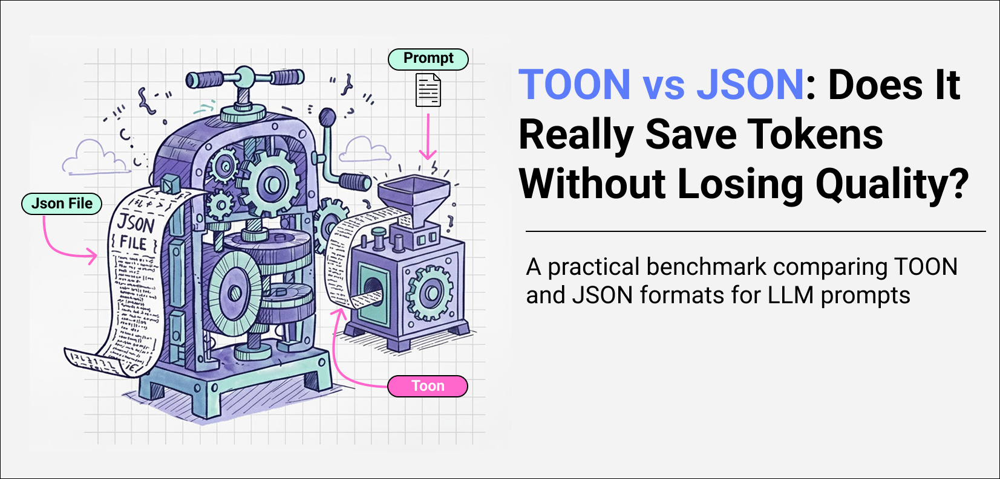

# TOON vs JSON: Does It Really Save Tokens Without Losing Quality?
_A practical benchmark comparing TOON and JSON formats for LLM prompts_

|**Tags:** `llm`, `ai`, `optimization`, `python`|
-------------------------------------------------

---

# Introduction

Over the past months, I came across several articles claiming that **TOON** can significantly reduce token usage in **LLM** prompts compared to traditional **JSON**. Most of these examples, however, relied on small or artificial datasets.
That raised a few questions for me:
* Does TOON still provide benefits with **real-world API responses**?
* How much does it actually reduce tokens?
* And more importantly: **does changing the format affect how an LLM interprets the data or the quality of the response**?

Answering these questions isn’t trivial. Tokenization depends on the dataset, the structure of the data, and even the LLM itself. Still, I wanted to run a **practical benchmark** to see whether TOON is worth considering in production pipelines or if it’s just an optimization that looks good on paper.

_This article walks through the experiment, the results, and the conclusions._

----

# What Is TOON (and How Is It Different from JSON)?
**TOON (Terse Object-Oriented Notation** is a data serialization format designed specifically for LLM prompts. The goal is simple: reduce syntactic overhead while remaining readable for both humans and machines.

---

# The Experiment
## Datasets
In this experiment, I wanted to test TOON with **realistic, publicly available data**, rather than small, manually created datasets. Using real API responses allows us to see how token savings and LLM behavior hold up in practical scenarios.
I selected **two public APIs with very different characteristics:**
* **1. GitHub Events API:** Returns a **stream of recent public events on GitHub**, such as pushes, pull requests, issues, and comments.
    * **URL:** https://api.github.com/events
    * **Data structure:** Deeply nested, heterogeneous objects with multiple levels of dictionaries and arrays.
    * **Why this matters:** Represents the kind of **complex operational API** data you might send to an LLM in real projects.
* **2.  Wikipedia Page Views API:** Returns the top-viewed articles on English Wikipedia for a given day.
    * **URL:** https://wikimedia.org/api/rest_v1/metrics/pageviews/top/en.wikipedia/all-access/2024/01/01
    * **Data structure:** Flat, repetitive lists of articles, each with numeric metrics (title, views, category).
    * **Why this matters:** Ideal for testing TOON’s efficiency with **flat, repetitive data**, where token savings are expected to be highest.

> Using these two APIs allows us to evaluate TOON in both **complex nested** and **flat list scenarios**, giving a more comprehensive view of its performance in real-world LLM prompts.

